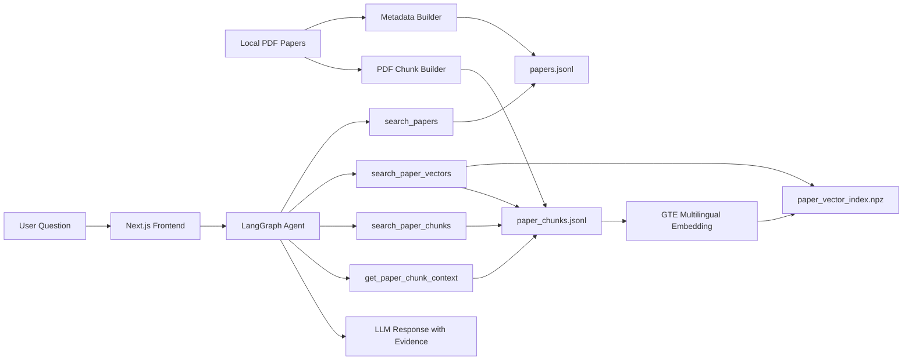

# Research Paper Agent

基于 LangGraph / LangChain 改造的本地论文库 RAG Agent。项目面向个人科研论文管理场景，支持从本地 PDF 论文库构建元数据、正文 chunk、GTE multilingual 本地向量索引，并通过 Agent 工具调用完成论文检索、语义召回、证据溯源和综合问答。

> 本项目由 Chat LangChain 改造而来，保留了 LangGraph Agent 后端和 Next.js 前端框架，将原来的 LangChain 文档问答场景改造成“本地论文检索与分析助手”。

## 项目亮点

- **本地论文库入库**：从 `data/raw_papers/` 读取 PDF，自动抽取标题、摘要、页数、来源文件等信息。
- **PDF 正文切片**：按页抽取论文正文，切分为可检索 chunk，并保留 `chunk_id`、页码、论文 ID 和来源文件。
- **语义向量检索**：使用本地 `Alibaba-NLP/gte-multilingual-base` embedding 模型，支持中文问题检索英文论文内容。
- **Agent 工具调用**：基于 LangGraph / LangChain Agent，将论文检索、向量召回、关键词检索、chunk 上下文读取封装成工具。
- **证据溯源回答**：回答中可返回 `paper_id`、`chunk_id`、页码、相似度分数和原文片段。
- **可视化前端**：Next.js 聊天界面，可直接在浏览器中与论文 Agent 交互。

## 系统架构



## 技术栈

| 模块 | 技术 |
| --- | --- |
| Agent 编排 | LangGraph, LangChain Agents |
| 大模型 | DeepSeek OpenAI-compatible API |
| Embedding | Alibaba-NLP/gte-multilingual-base, sentence-transformers |
| PDF 解析 | pypdf |
| 数据存储 | JSONL, NumPy compressed vector index |
| 后端服务 | LangGraph dev server, FastAPI |
| 前端 | Next.js, React, TypeScript |

## Agent 工具设计

| 工具 | 作用 |
| --- | --- |
| `search_papers` | 根据标题、摘要、主题和笔记检索候选论文 |
| `search_paper_vectors` | 使用本地 GTE embedding 对 PDF chunk 做语义向量检索 |
| `search_paper_chunks` | 对 PDF chunk 做关键词检索，适合精确术语匹配 |
| `get_paper_detail` | 根据 `paper_id` 获取论文元信息 |
| `get_paper_chunk_context` | 根据 `chunk_id` 获取前后文 |
| `list_papers` | 列出当前论文库或按主题筛选 |

## 数据处理流程

1. 将论文 PDF 放入：

```bash
data/raw_papers/
```

2. 构建论文元数据：

```bash
uv run python scripts/build_paper_library.py --fetch-metadata
```

3. 构建 PDF 正文 chunk：

```bash
uv run python scripts/build_paper_chunks.py
```

4. 下载本地 embedding 模型：

```bash
uv run python scripts/download_embedding_model.py
```

5. 构建向量索引：

```bash
uv run python scripts/build_paper_vector_index.py --batch-size 8 --max-seq-length 512
```

生成的数据文件包括：

```text
data/papers/papers.jsonl
data/papers/paper_chunks.jsonl
data/papers/paper_vector_index.npz
models/gte-multilingual-base/
```

这些文件默认不建议上传 GitHub，应该在本地或服务器上自行生成。

## 环境配置

复制环境变量模板：

```bash
copy .env.example .env
```

核心配置：

```bash
DEEPSEEK_API_KEY=your_api_key
DEFAULT_MODEL_KEY=deepseek-v4-flash

PAPER_LIBRARY_PATH=data/papers/papers.jsonl
PAPER_CHUNKS_PATH=data/papers/paper_chunks.jsonl
PAPER_VECTOR_INDEX_PATH=data/papers/paper_vector_index.npz

EMBEDDING_MODEL_PATH=models/gte-multilingual-base
EMBEDDING_MAX_SEQ_LENGTH=512
```

不要把 `.env` 上传到 GitHub。

## 本地运行

后端：

```bash
uv run langgraph dev --host 127.0.0.1 --port 2024 --no-browser --no-reload
```

前端：

```bash
cd frontend
npm ci
npm run dev:local
```

浏览器打开：

```text
http://localhost:3000
```

第一次进行向量检索时，本地 GTE 模型需要加载到内存，响应会稍慢；后续查询会更快。

## 示例问题

```text
请使用语义向量检索，说明 RAPTOR 的 tree traversal retrieval 是怎么工作的，并给出 chunk_id、页码和相似度。
```

```text
检索和 long document summarization agent 相关的论文，列出 paper_id、标题和相关原因。
```

```text
对比 RAPTOR、LongAgent、GraphReader 在长文档处理上的区别，并引用 PDF 正文证据。
```

```text
论文库里有哪些和 multi-agent 或 agent workflow 相关的论文？
```
