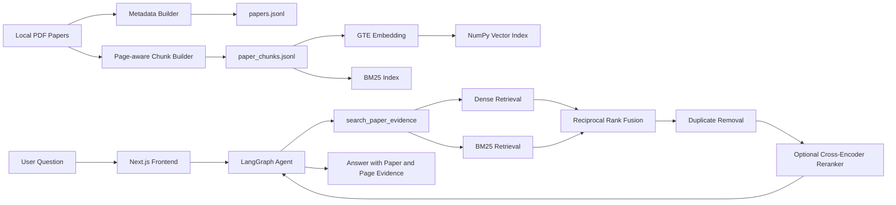

# Research Paper Agent

面向本地英文论文库的可追溯 RAG Agent。项目基于 Chat LangChain 二次开发，使用 LangGraph 提供 Agent 运行服务，使用 LangChain Tool Calling 连接论文检索工具，实现论文发现、证据检索、方法对比和相关工作分析。

项目不会把 PDF、模型权重或生成的向量索引提交到 GitHub。所有数据均通过脚本在本地构建，回答中的 `paper_id`、`chunk_id`、页码和原文片段可用于证据核验。

## 核心能力

- **PDF 论文入库**：抽取标题、作者、摘要、年份、来源文件等元数据。
- **可追溯切片**：按页切分正文，保留 `paper_id`、`chunk_id`、页码和来源文件。
- **混合检索**：并行执行 GTE Dense Retrieval 与 BM25 Sparse Retrieval，通过 RRF 融合排名。
- **可选重排**：使用本地 `BAAI/bge-reranker-v2-m3` Cross-Encoder 对融合候选重新打分。
- **统一检索工具**：Agent 只调用 `search_paper_evidence`，检索工具内部负责召回、融合、去重和重排。
- **论文级评测**：提供 20 条人工标注查询，对比 Dense、BM25、Hybrid 和 Hybrid + Reranker。

## 系统架构



## 检索流程

1. 使用 `gte-multilingual-base` 将查询编码为 768 维向量，与本地 chunk 向量计算相似度。
2. 使用 BM25 对标题、章节名和正文进行精确术语召回。
3. 使用 Reciprocal Rank Fusion 融合两路排名，避免直接比较不同量纲的原始分数。
4. 按标题和正文内容去重，记录重复 chunk ID，降低重复 PDF 对结果的影响。
5. 可选使用 `bge-reranker-v2-m3` 对查询与候选证据进行 Cross-Encoder 打分。
6. 返回论文 ID、chunk ID、页码、来源文件、证据片段及各阶段分数。

默认使用 Hybrid 模式。当前 CPU 环境下 Reranker 延迟较高，因此默认关闭，可通过环境变量按需启用。

## Agent 工具

| 工具 | 作用 |
| --- | --- |
| `search_papers` | 根据标题、摘要和主题发现候选论文 |
| `search_paper_evidence` | 执行 Dense + BM25 + RRF 混合检索及可选重排 |
| `get_paper_detail` | 根据 `paper_id` 获取论文元数据 |
| `get_paper_chunk_context` | 根据 `chunk_id` 获取相邻上下文 |
| `list_papers` | 浏览当前本地论文库 |

旧版向量检索和关键词检索函数仍保留用于消融评测，但不再直接暴露给 Agent。这样可以避免模型自行决定检索组合，保证线上检索流程一致。

## 检索评测

当前本地语料包含 20 份 PDF、18 个唯一标题、1569 个 chunk。评测集包含 20 条中英文人工标注查询，重复 PDF ID 按等价文档处理，指标按论文级结果计算。

| 模式 | Recall@5 | MRR@10 | nDCG@10 | 平均延迟 |
| --- | ---: | ---: | ---: | ---: |
| Dense | 1.0000 | 1.0000 | 1.0000 | 57.6 ms |
| BM25 | 1.0000 | 0.9375 | 0.9531 | 5.1 ms |
| Hybrid RRF | 1.0000 | 1.0000 | 0.9960 | 62.7 ms |
| Hybrid + Reranker | 1.0000 | 1.0000 | 1.0000 | 18111.3 ms |

这组小规模同域评测中，Reranker 没有带来额外准确率收益，但显著增加 CPU 延迟，因此系统默认使用 Hybrid RRF。评测结果用于展示当前语料上的工程权衡，不代表通用检索基准。

复现评测：

```powershell
uv run python scripts/evaluate_retrieval.py
```

评测样本位于 `evaluation/retrieval_cases.json`，完整报告位于 `evaluation/reports/latest_retrieval.json`。

## 技术栈

| 模块 | 技术 |
| --- | --- |
| Agent 服务 | Python、LangGraph、LangChain |
| 推理模型 | DeepSeek OpenAI-compatible API |
| Dense Retrieval | Alibaba-NLP/gte-multilingual-base、sentence-transformers、NumPy |
| Sparse Retrieval | BM25、rank-bm25 |
| 排名融合 | Reciprocal Rank Fusion |
| Reranker | BAAI/bge-reranker-v2-m3、CrossEncoder |
| PDF 处理 | pypdf、JSONL |
| 前端 | Next.js、React |

## 本地数据构建

将 PDF 放入：

```text
data/raw_papers/
```

依次执行：

```powershell
uv run python scripts/build_paper_library.py --fetch-metadata
uv run python scripts/build_paper_chunks.py
uv run python scripts/download_embedding_model.py
uv run python scripts/build_paper_vector_index.py --batch-size 8 --max-seq-length 512
```

可选下载本地 Reranker：

```powershell
uv run python scripts/download_reranker_model.py
```

生成内容：

```text
data/papers/papers.jsonl
data/papers/paper_chunks.jsonl
data/papers/paper_vector_index.npz
models/gte-multilingual-base/
models/bge-reranker-v2-m3/
```

## 环境配置

复制 `.env.example` 为 `.env`，至少填写模型 API Key：

```text
DEEPSEEK_API_KEY=your_api_key
DEFAULT_MODEL_KEY=deepseek-v4-flash

PAPER_LIBRARY_PATH=data/papers/papers.jsonl
PAPER_CHUNKS_PATH=data/papers/paper_chunks.jsonl
PAPER_VECTOR_INDEX_PATH=data/papers/paper_vector_index.npz

EMBEDDING_MODEL_PATH=models/gte-multilingual-base
RERANKER_MODEL_PATH=models/bge-reranker-v2-m3
RERANKER_ENABLED=false
PAPER_RRF_K=60
```

不要提交 `.env` 或任何真实 API Key。

## 本地运行

后端：

```powershell
uv run langgraph dev --host 127.0.0.1 --port 2024 --no-browser --no-reload
```

前端：

```powershell
cd frontend
npm ci
npm run dev:local
```

浏览器打开 `http://localhost:3000`。

## 示例问题

```text
说明 RAPTOR 的 tree-organized retrieval 如何工作，并给出 paper_id、chunk_id、页码和原文证据。
```

```text
对比 LongAgent、GraphReader 和 RAPTOR 在长文档处理方式上的差异，并引用论文正文。
```

```text
论文库中有哪些自动生成 Agent workflow 的研究？比较它们的搜索策略。
```
